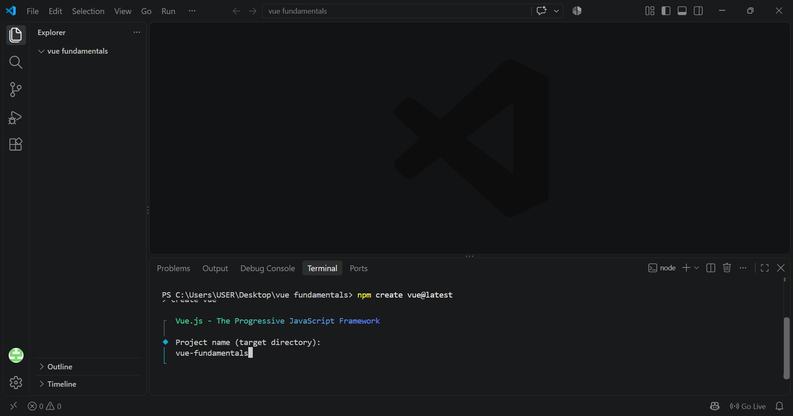
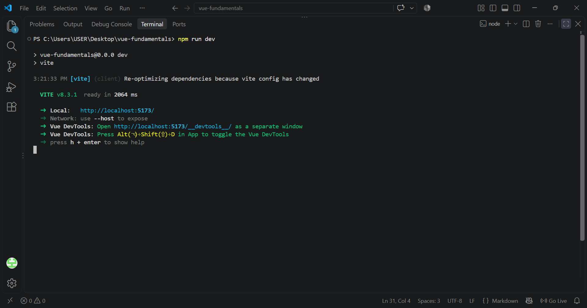
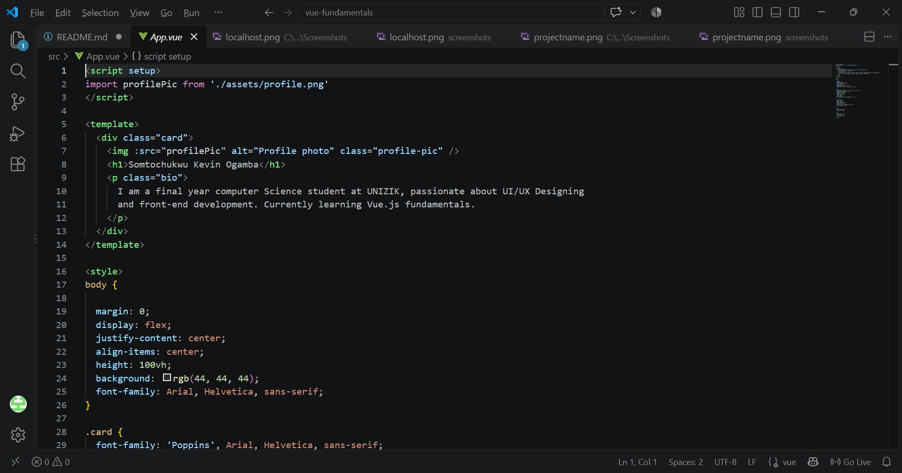
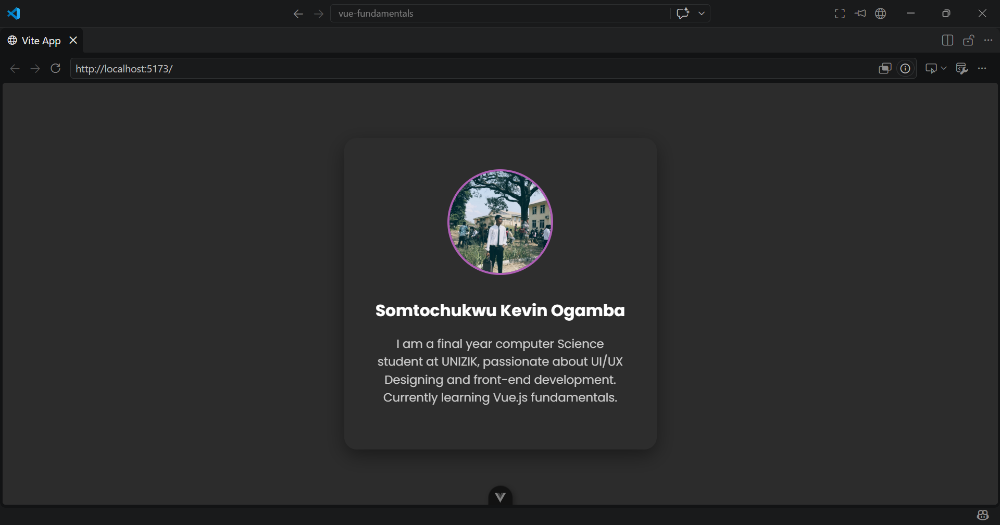

## Day 1 — Setup & First Component

### Topic
Node/Vite setup, project structure, and the anatomy of a `.vue` file (`<template>`, `<script>`, `<style>`).

### Milestone
Scaffold a Vite + Vue 3 app and render a personal profile card showing name, photo, and bio.

### 1. Project Setup & Installation

1. **Create the project:**
   
   npm create vue@latest
   
   Project named `vue-fundamentals`.

   *Screenshot*
   

2. **Move into the project folder:**
   
   cd vue-fundamentals

3. **Install dependencies:**
   
   npm install

4. **Run the dev server:**

   npm run dev
   

5. **Open the local URL** (usually `http://localhost:5173`) in a browser to view the running app.

 *Screenshot*
   

### 2. Building the Profile Card

- **Photo** — imported from `src/assets/`, displayed as a circular avatar
- **Name** — Somtochukwu Kevin Ogamba
- **Bio** — short description of background (Computer Science student at UNIZIK, front-end/UI-UX)

Used the three core sections of a `.vue` file:
- `<script setup>` — imports the profile image
- `<template>` — markup for the card: image, name, bio
- `<style>` — styling for layout, colors, and the circular photo

*Screenshot*

### 3. Styling
- Centered card layout using flexbox on `body`
- Dark theme background (`rgb(44, 44, 44)`) with a contrasting card (`rgb(45, 45, 45)`)
- Circular profile photo with a purple accent border (`rgb(174, 94, 181)`)
- Card text set to **Poppins** (via Google Fonts import), falling back to Arial/Helvetica

### 4. Pushing to GitHub

1. Initialized git:
   
   git init
   
2. Staged and committed:
   
   git add .
   git commit -m "Day 1 - Vue fundamentals profile card"
   
3. Connected to a new GitHub repository:
   
   git remote add origin https://github.com/keV-hub7/vue-fundamentals.git
   
4. Pushed:
   
   git branch -M main
   git push -u origin main
   

**Repo link:** https://github.com/keV-hub7/vue-fundamentals

### Result
A working Vue 3 + Vite app rendering a clean, centered personal profile card (photo, name, bio) in a dark theme with Poppins typography, demonstrating basic project scaffolding and the template/script/style structure of a Vue component.

*Screenshot*
