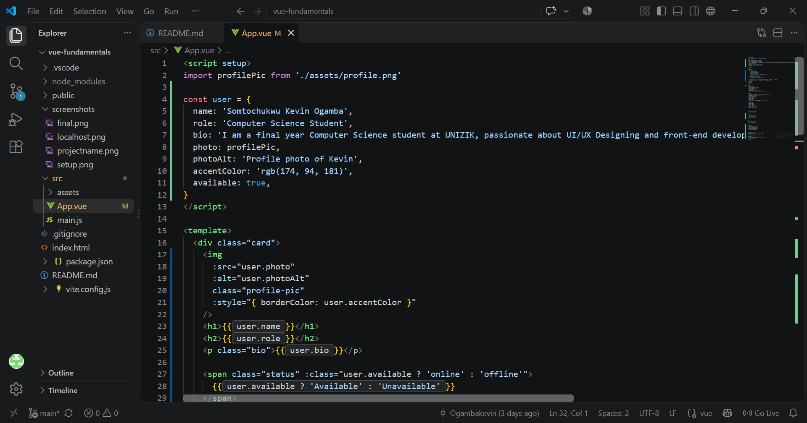
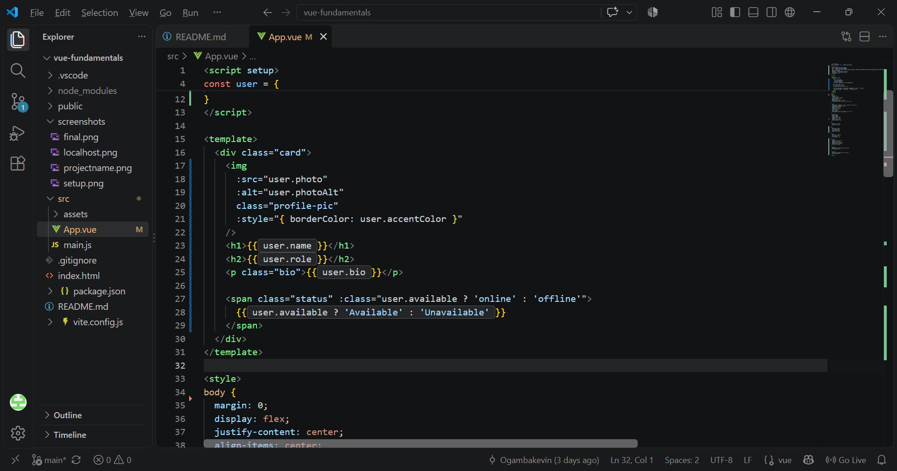

## Day 1 — Setup & First Component

### Topic
Node/Vite setup, project structure, and the anatomy of a `.vue` file (`<template>`, `<script>`, `<style>`).

### Milestone
Scaffold a Vite + Vue 3 app and render a personal profile card showing name, photo, and bio.

### 1. Project Setup & Installation

1. **Create the project:**
   
   npm create vue@latest
   
   Project named `vue-fundamentals`.

   *Screenshot*
   

2. **Move into the project folder:**
   
   cd vue-fundamentals

3. **Install dependencies:**
   
   npm install

4. **Run the dev server:**

   npm run dev
   

5. **Open the local URL** (usually `http://localhost:5173`) in a browser to view the running app.

 *Screenshot*
   

### 2. Building the Profile Card

- **Photo** — imported from `src/assets/`, displayed as a circular avatar
- **Name** — Somtochukwu Kevin Ogamba
- **Bio** — short description of background (Computer Science student at UNIZIK, front-end/UI-UX)

Used the three core sections of a `.vue` file:
- `<script setup>` — imports the profile image
- `<template>` — markup for the card: image, name, bio
- `<style>` — styling for layout, colors, and the circular photo

*Screenshot*


### 3. Styling
- Centered card layout using flexbox on `body`
- Dark theme background (`rgb(44, 44, 44)`) with a contrasting card (`rgb(45, 45, 45)`)
- Circular profile photo with a purple accent border (`rgb(174, 94, 181)`)
- Card text set to **Poppins** (via Google Fonts import), falling back to Arial/Helvetica

### 4. Pushing to GitHub

1. Initialized git:
   
   git init
   
2. Staged and committed:
   
   git add .
   git commit -m "Day 1 - Vue fundamentals profile card"
   
3. Connected to a new GitHub repository:
   
   git remote add origin https://github.com/keV-hub7/vue-fundamentals.git
   
4. Pushed:
   
   git branch -M main
   git push -u origin main
   

**Repo link:** https://github.com/keV-hub7/vue-fundamentals

### Result
A working Vue 3 + Vite app rendering a clean, centered personal profile card (photo, name, bio) in a dark theme with Poppins typography, demonstrating basic project scaffolding and the template/script/style structure of a Vue component.

*Screenshot*


## Day 2 — Template Syntax & Interpolation

### Topic
`{{ }}` interpolation, `v-bind` (attribute binding), and class/style binding.

### Milestone
Make the profile card dynamic: the data comes from a JavaScript object instead of being hardcoded in the HTML.

### 1. Moving the Data into a JavaScript Object

In Day 1, the name, bio and photo were typed directly into the template. In Day 2, all of that information was moved into a `user` object inside `<script setup>`:

```js
const user = {
  name: 'Somtochukwu Kevin Ogamba',
  role: 'Computer Science Student',
  bio: 'I am a final year Computer Science student at UNIZIK, passionate about UI/UX Designing and front-end development. Currently learning Vue.js fundamentals.',
  photo: profilePic,
  photoAlt: 'Profile photo of Kevin',
  accentColor: 'rgb(174, 94, 181)',
  available: true,
}
```

The template now reads its content from this object. Editing a value in the object updates the card without changing the HTML.

*Screenshot*


### 2. Bound Properties

- Interpolation  `{{ user.name }}`  Displays the name as text 
- Interpolation  `{{ user.role }}`  Displays the role as text 
- Interpolation  `{{ user.bio }}`  Displays the bio as text 
- Attribute binding (`v-bind`)  `:src="user.photo"`  Sets the image source from data 
- Attribute binding (`v-bind`)  `:alt="user.photoAlt"`  Sets the image alt text from data 
- Style binding  `:style="{ borderColor: user.accentColor }"` Sets the photo border color from data 
- Class binding  `:class="user.available ? 'online' : 'offline'"`  Applies a green or red badge style based on a true/false value 

**Interpolation (`{{ }}`)** inserts a value as text between tags:
```html
<h1>{{ user.name }}</h1>
```

**Attribute binding (`v-bind`, written as `:`)** is used when a value has to go inside an HTML attribute, where `{{ }}` cannot be used:
```html

```

**Style binding** takes an object of CSS properties written in camelCase:
```html
:style="{ borderColor: user.accentColor }"
```

**Class binding** chooses a class from a condition:
```html
<span class="status" :class="user.available ? 'online' : 'offline'">
  {{ user.available ? 'Available' : 'Unavailable' }}
</span>
```

*Screenshot*


### 3. Result in the Browser

The card now shows the photo, name, role, bio and an availability badge, all driven by the `user` object.

*Screenshot*


Setting `available: false` in the object changes the badge to red and the text to "Unavailable", which confirms the card responds to its data.

*Screenshot: card with `available: false`*


### 4. Pushing to GitHub

git add .
git commit -m "Day 2 - dynamic profile card with data binding"
git push


**Repo link:** https://github.com/keV-hub7/vue-fundamentals

### What I Learned
- Data can live in a JavaScript object and be displayed in the template, which keeps content and markup separate.
- `{{ }}` is for text, while `v-bind` (`:`) is for attributes, including `class` and `style`.